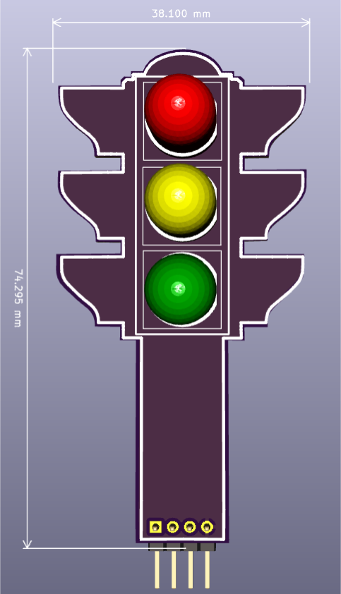

# Aprendiendo electrónica y programación utilizando semáforos
*(título propuesto por La Hora Maker, aka Cesar García)*

Proyecto colectivo de realizar semáforos en la mayor cantidad de modos posible.

*PCB de semáforo por Gustavo Reynaga*

## Lista de Ejemplos

* Jose Antonio Vacas, @javacasm: introducción (aquí forzando)
* Julián Caro Linares, @jcarolinares: FPGA
* David Cuartielles, @dcuartielles: Arduino
* Raúl Lapeira Herrero, @raul_lapeira: Skypic
* Josemanu, @Ardumania_Jmanu: CircuitPython
* Jorge, @akirasan: ATtiny85 + Arduino como programador
* Luis Miranda, @LuisMirandaAceb: 555s y componentes discretos
* María L, @tecnoloxia: semáforo mecánico
* María L, @tecnoloxia: Scratch
* David Estévez, @DEFrobotics: RPi + WiringPi
* David Estévez, @DEFrobotics: Semáforo con robot industrial (por los loles)
* Nuria y Jorfru, @nuria_pp: DGT
* Gustavo Reynaga, @gsreynaga: [PCB personalizada con KiCad.](https://github.com/dcuartielles/semaforos/tree/master/ejemplos/KiCad)  [hulkco](https://github.com/hulkco?tab=repositories)
* Iraisy Figueroa, @Iraisy: circuito textil con 555
* Iraisy Figueroa, @Iraisy: S4A
* Alex Corvis, @AlexCorvis84: Node-RED
* Alex Corvis, @AlexCorvis84: MicroPython
* Jose Luis V., @Movilujo: ESP8266
* Raul Tkcheriuk, @RaulTkcheriuk: PLC
* Nerea Iriepa, @nereairiepa: semáforo con servos
* Luis del Valle, @programarfacilc: MKR1000 + Blynk
* Miguel Ángel Abellán, @migueabellan: mBlock
* Victor Barahona, @VictorJBarahona: RaspberryPi3 + Thinger.io   [Egokitek](https://github.com/Egokitek?tab=repositories)
* Manuel Hidalgo, @leobotmanuel: semáforo RGB + ATmega32U4 (Arduino micro)
* Manuel Hidalgo, @leobotmanuel: micro:bit
* Moises Fernandez, @moifdz : ESP8266 con Thingerio [moisesfa](https://github.com/moisesfa?tab=repositories)
* Andrés Sabas, @sabasacustico : Maker MakeCode con Arduino MKR1300 [sabas1080](https://github.com/sabas1080?tab=repositories)
* José Fernando Picó Antolí @JoseFdo_  :FPGA ICE40 de lattice + IDE Icestudio
* Jorge Ramos, @GioSunrider : Semáforo de Competicion
* José Pujol, @Josepujol: Snap4Arduino & EchidnaShield
* Juan González-Gómez @Obijuan: Semáforo en pantalla VGA con FPGA

Haz un pull request y añade tu nombre, nick de twitter (si lo tienes), y el proyecto. Si escribes tu nick the github, te haremos contribuidor oficial para no tener que andar jugando con pull-requests después.

## Como contribuir

0. Haz el juramento de Iraisy Figueroa: "Prometo solemnemente no recurrir al semáforo en mis clases, en su lugar buscaré siempre una alternativa mejor, Amén"
1. Haz un pull request del proyecto
2. Dentro de la carpeta ejemplos, crea una carpeta con el nombre de la plataforma sobre la que haras tu ejemplo
3. Crea una subcarpeta "img" donde meter las imágenes, como queremos imprimir esto, usa SVG para poder sacar lo mejor del asunto. Necesitaremos esquemas, dibujos escaneados, ilustraciones con Fritzing, dibujos mecánicos ... lo que sea que uses
4. Crea una subcarpeta "src" y pon ahí el código
5. Si usas un lenguaje de bloques, además de poner el xml o lo que sea que genere tu sistema, haz una captura de pantalla del programa en modo gráfico
6. Crea un Readme.md (usa markdown) y ...
7. Escribe un pequeño párrafo sobre tí misma (unas 100 palabras)
8. Escribe un párrafo sobre la plataforma que has elegido (hasta 500 palabras)
9. Explica tu proyecto (aquí usa lo que necesites, pero se buena, no te pases ... colega)
10. Si eres @javacasm olvida todo lo anterior y escribe una introducción sobre la historia del semáforo

## Licencia

Este manual se presenta bajo [Creative Commons 0](https://creativecommons.org/publicdomain/zero/1.0/) (o dominio público para los amigos) todo el código está bajo [GPLv3](https://www.gnu.org/licenses/gpl-3.0.en.html) a no ser que se diga lo contrario en uno de los ejemplos.
