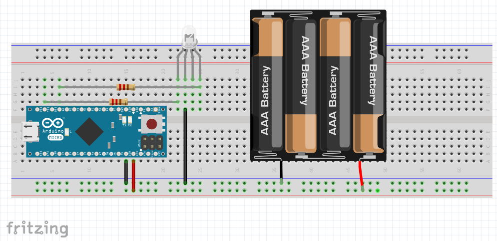

# Arduino Micro

Este es el ejemplo de cómo hacer un semáforo usando una placa Arduino Micro oficial.

[Código](src/prog_Semaforo.ino)

[video](https://youtu.be/-Rn8SLBAzyY)

## Sobre el autor

Manuel Hidalgo - LeoBot - [@leobotmanuel](https://github.com/leobotmanuel)

## Porqué esta plataforma

Pues resulta que Arduino Micro es un pasito más a Arduino en el apasionante mundo la programación de sistemas embebidos.

## Cómo y porqué de tu proyecto

El hashtag #NoMásSemáforos me parece necesario para introducir cualquier plataforma por parte del docento o ponente.
De esta manera, quiero aportar que no sea un reto para el aprendizaje.

Aquí se práctica como cargar el programa desde el IDE de Arduino (con reseteo en el upload) y la progrmación de un semáforo
con un led RGB y dos resistencias. Tiene una mezcla de colores y de ahí su nombre se "SEMAFORO ANALOGICO"
