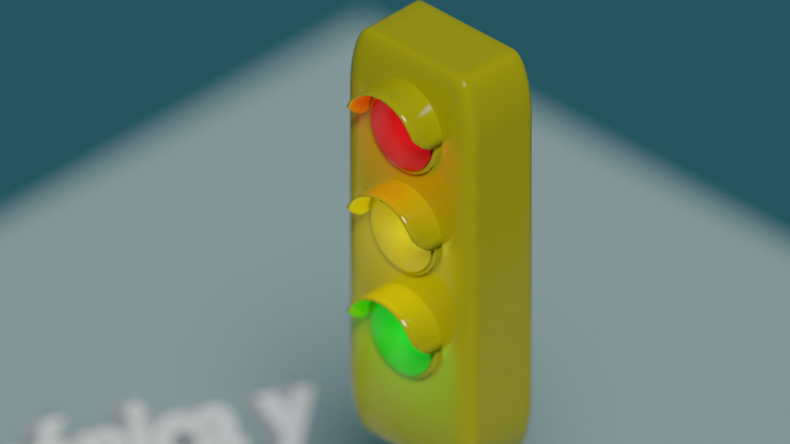
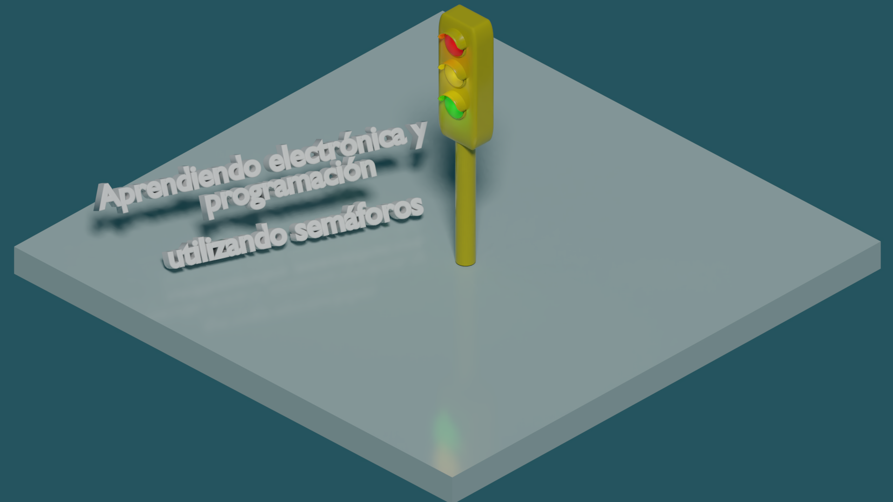
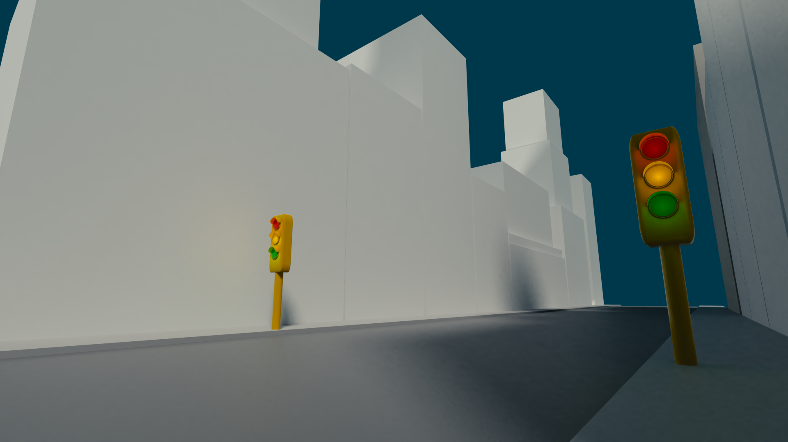

# Blender 2.79b

Ejemplo de diseño de un semáforo mediante Blender.

## Sobre el autor

Me llamo Jorge, aunque algunos me conocen como @akirasan. Desde que en 2011 conocí Arduino no he querido parar de aprender, y para aprender utilizo una técnica muy sencilla: construir cosas. Manteniendo la curiosidad por saber cómo funcionan las cosas. Y Arduino me abrió una puerta a la electrónica digital. Un mundo que desconocía casi por completo, ya que siempre he estado mas enfocado al software abierto, pero no al hardware abierto.

A nivel personal soy miembro (me tienen puesto de presidente) de una comunidad de Makers llamada Ripola Hacklab, dónde hacemos divulgación de la tecnología a la Comunidad Educativa. Buscamos hacer cosas chulas para que las familias construyan y aprendan juntas.

## Porqué esta plataforma

Blender es un software de código abierto para el modelado y animación 3D. 

## Cómo y porqué de tu proyecto

El "cómo y porqué" del proyecto es claro: Nos calentamos muy rápido por Twitter.
Soy muy fan del hashtag [#NoMásSemáforos][3]. Creo que se pueden aprender y hacer muchas cosas chulas, mas allá de los semáforos (que viene a ser el tipico ejemplo recurrente y poco atractivo).

La curva de aprendizaje de Blender es bastante compleja. Centrarse en tantos aspectos del mundo del modelado y animación 3D requiere tiempo. Comenzar por ejemplos sencillos y tutoriales basado en lowpoly es un buen inicio. Aunque alguno de los ejemplos no es lowpoly, son modelos muy sencillos de replicar.

Los materiales utilizados son PRB Materials de [3d-wolf](https://www.3d-wolf.com/products/materials.html)

[1]: https://www.akirasan.net
[2]: https://github.com/akirasan
[3]: https://twitter.com/hashtag/nomassemaforos
