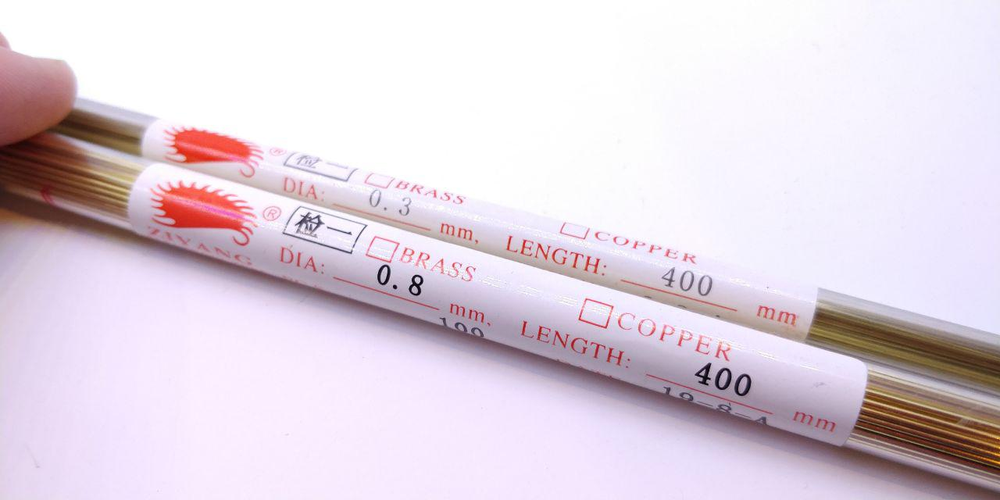
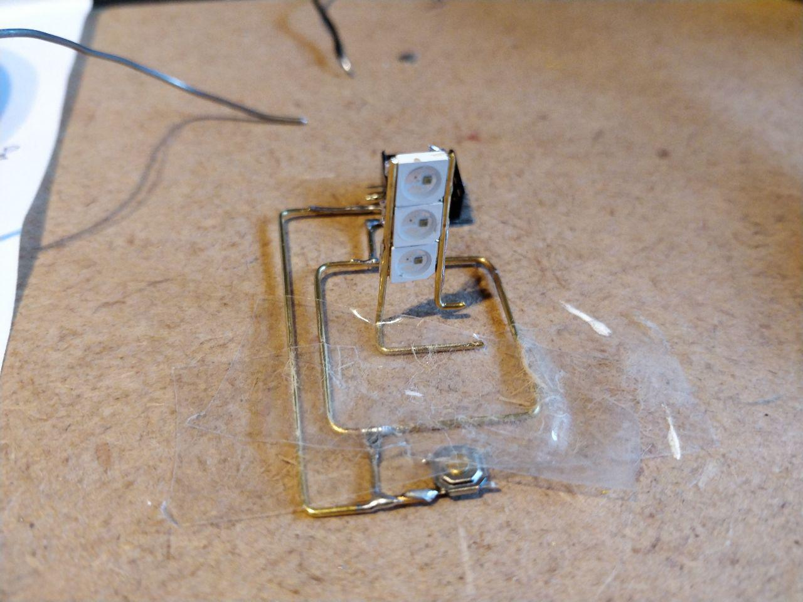
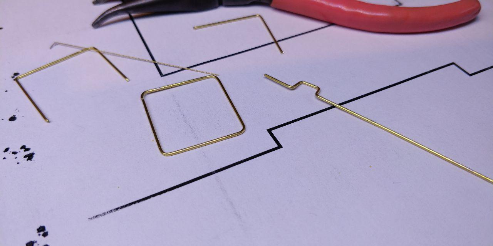
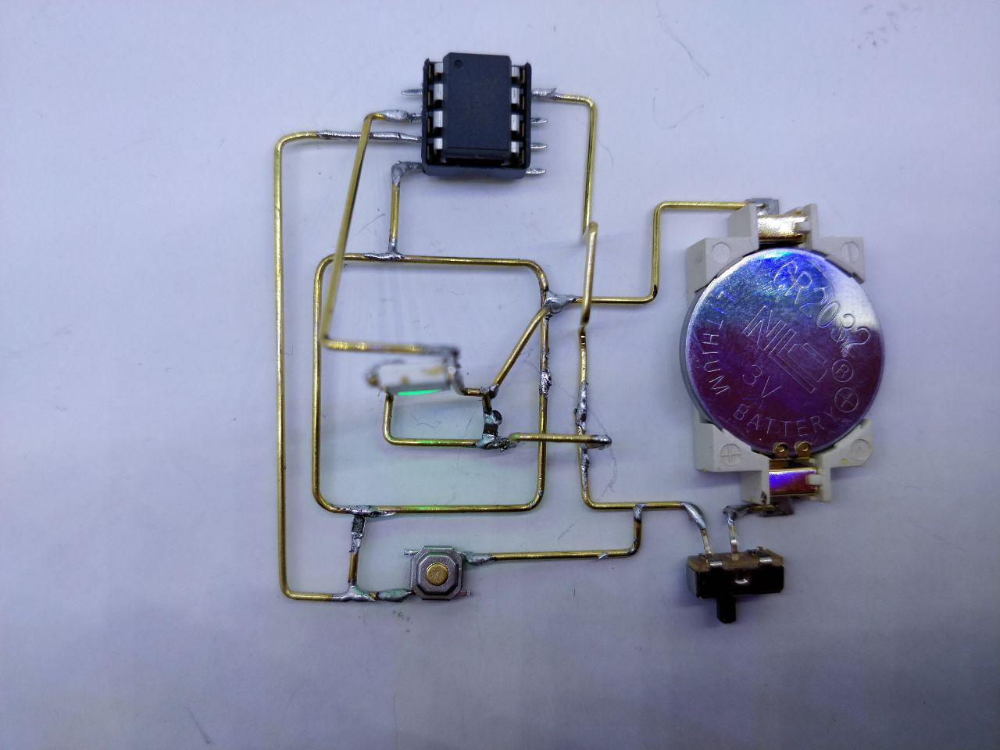
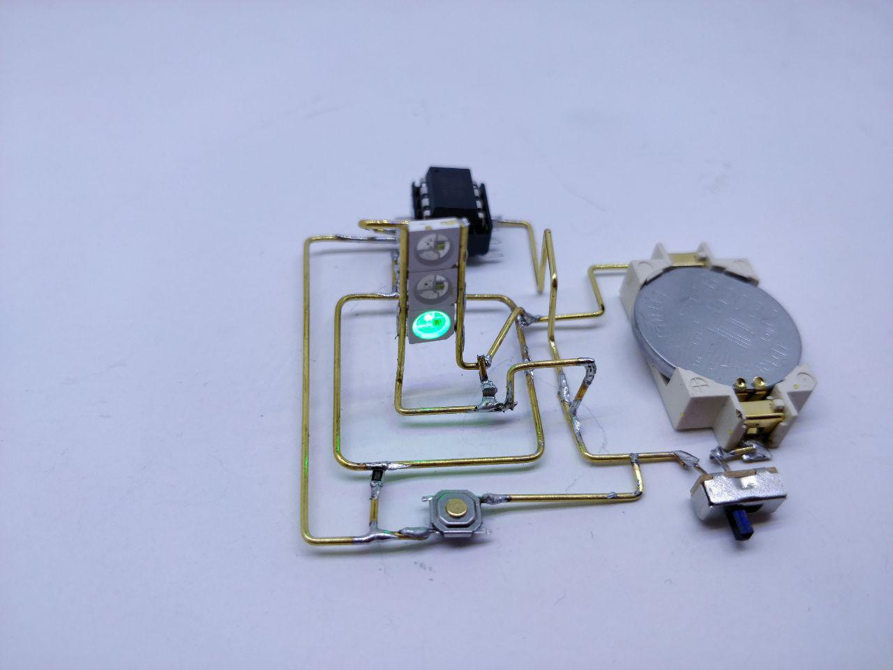
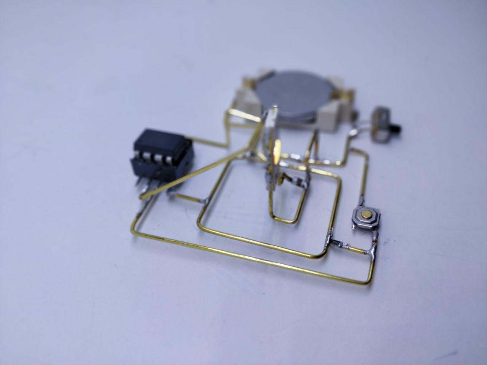

# Free Form Circuit

Free Form Circuit consiste en crear un circuito electrónico sin cables, consiguiendo crear estructuras al aire de los mas molonas. Para ello se utilizan tubos de cobre en lugar de cables para unir las diferentes partes del circuito.

El material que he utilizado ha sido éste:

- Tubo de cobre de 0.8mm de diámetro (primero probé con 0.3mm pero no tiene consistencia suficiente para poder generar estructuras)

- Cinta adhesiva. Al no tener una superficie fija, las varillas cortadas se mueven fácilmente, por lo que utilizar una cinta adhesiva ayuda en el momento de la soldadura.

- Plantilla con ángulos rectos.

- Alicates de corte y alicates planos para doblar los tubos.

Mucha paciencia y cariño, ya que hay que trabajar observando y comprobando claramente que los diferentes tubos no hagan cortocircuito.

Algunas de las imágenes del proyecto una vez finalizado:

También está adjunto el esquema del circuito que he utilizado, aunque no he implementado toda su funcionalidad en el ejemplo.

Y si se quiere ver como funciona, un vídeo en youtube de éste proyecto: https://youtu.be/Ce5SSv6fpuk

## Sobre el autor

Me llamo Jorge, aunque algunos me conocen como @akirasan. Desde que en 2011 conocí Arduino no he querido parar de aprender, y para aprender utilizo una técnica muy sencilla: construir cosas. Manteniendo la curiosidad por saber cómo funcionan las cosas. Y Arduino me abrió una puerta a la electrónica digital. Un mundo que desconocía casi por completo, ya que siempre he estado mas enfocado al software abierto, pero no al hardware abierto.

A nivel personal soy miembro (me tienen puesto de presidente) de una comunidad de Makers llamada Ripola Hacklab, dónde hacemos divulgación de la tecnología a la Comunidad Educativa. Buscamos hacer cosas chulas para que las familias construyan y aprendan juntas.

## Porqué esta plataforma

Motivado por los grandes ejemplos de otros creadores de estas estructuras:

- Jiří Praus: https://twitter.com/jipraus
- Mohit Bhoite: https://twitter.com/MohitBhoite
- Eirik Brandal: https://www.instagram.com/eirikbrandal/?hl=es

## Cómo y porqué de tu proyecto

Una forma de creación artística, que tal vez pueda ayudar a enganchar a perfiles no tan técnicos en utilizar la tecnología de forma creativa,... eso si, con diseños mas artísticos el mío, jejeje.

[1]: https://www.akirasan.net
[2]: https://github.com/akirasan
[3]: https://twitter.com/hashtag/nomassemaforos
