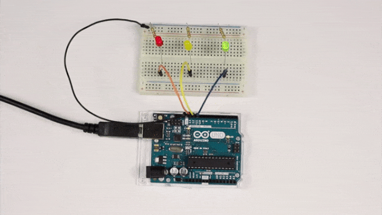
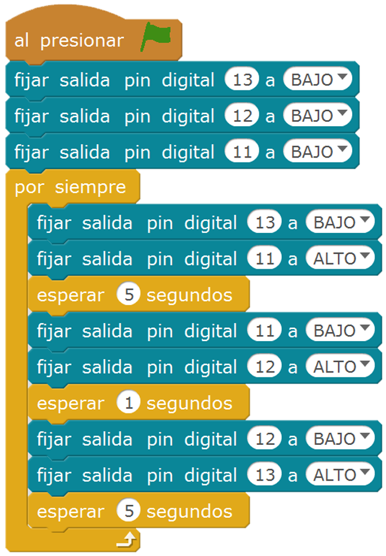

# mBlock

Este es el ejemplo de cómo programar un semáforo sencillo mediante el lenguaje de programación por bloques de mBlock usando una placa Arduino UNO oficial.

## Sobre el autor

 [Miguel Ángel Abellán][1]

## Porqué esta plataforma

mBlock es un entorno gráfico de programación basado en Scratch 2.0 para que principiantes en la programaicón y robótica puedan programar robots con Arduino de una forma muy sencilla.

## Cómo y porqué de tu proyecto

Aunque apoyo el hashtag [#NoMásSemáforos][1], como docente creo que un alumno debe pasar por esta práctica en sus inicios, **insisto**, **en sus inicios** solamente.

[1]: https://github.com/migueabellan
[2]: https://twitter.com/hashtag/nomassemaforos