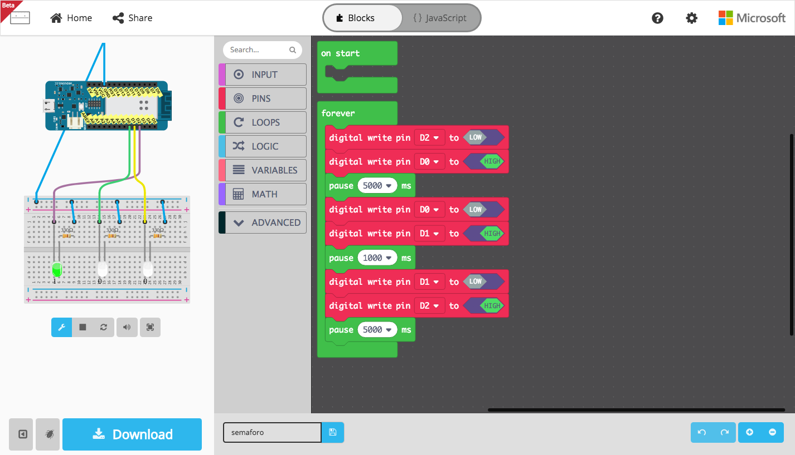

# Maker MakeCode

Este es el ejemplo de cómo hacer un semáforo usando una placa con un microcontroldor SAMD21.

## Sobre el autor

Andrés Sabas - @sabasacustico - [@sabas1080](https://github.com/sabas1080), Hecho con ♥️ desde México

## Porqué esta plataforma

MakeCode es una plataforma para programacion por bloques opensource, soportada por Microsoft, tiene soporte para microcontroladores SAMD21 y el famoso Micro:bit, se ejecuta en una PC o una tablet facilmente sin instalar nada.

## Cómo y porqué de tu proyecto

He estado manejando MakeCode los ultimos seis meses se me hace una buena plataforma para iniciar con la logica de programación y microcontroladores de 32 bits de una manera sencilla. #NoMásSemáforos

## Licencia
GPLV3